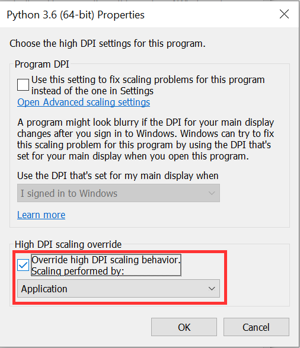

<!-- TOC -->

- [简介](#简介)
- [第三方软件包](#第三方软件包)
- [使用方法](#使用方法)
    - [设置邮箱信息](#设置邮箱信息)
    - [运行服务程序](#运行服务程序)
    - [发送指令邮件](#发送指令邮件)
    - [支持的指令](#支持的指令)
- [Q&A 常见问题](#qa-常见问题)
    - [我的屏幕分辨率是1920*1080, 为何ImageGrab 只给我1280*720的分辨率?](#我的屏幕分辨率是19201080-为何imagegrab-只给我1280720的分辨率)

<!-- /TOC -->

利用邮件向Windows主机发送并指令
========

# 简介
利用邮件向Windows主机发送并指令, 执行的结果通过邮件回复.

其实也没啥用, 只是写着玩儿 ^_^

# 第三方软件包

安装Pillow模块, 用于截屏操作.
```bash
pip install Pillow
```

如果需要设置代理才能通过POP3/SMTP收发邮件(比如在公司网络里), 需要安装安装 Pysocks模块:
```bash
pip install Pysocks
```

# 使用方法

## 设置邮箱信息
打开`config.py` 文件进行编辑
``` python
class Config(object):
    SMTP_SERVER  = "smtp.163.com" # 发送邮件的服务器
    SMTP_PORT    = 0 # 通常设为0即可, 除非服务器指定使用特殊端口
    POP_SERVER   = "pop.163.com" # 接收邮件的服务器
    POP_INTERVAL = 1 # 接收邮件的间隔, 单位为分钟. 建议不要太频繁, 5~10分钟为宜.
    ENABLE_SSL   = False # 是否启用SSL, True(是), False(否)
    USERNAME     = "xxxx@163.com" # 邮箱账户名
    PASSWORD     = "xxxx" # 邮箱账户密码 (有些邮箱用的是授权码)
    ENABLE_PROXY = True  # 是否启用代理, True(是), False(否), 如果设为True, 需要配置下面三个参数
    PROXY_TYPE   = 'HTTP' # HTTP, SOCKS4, SOCKS5 三选一, 其中HTTP比较常用
    PROXY_IP     = 'xx.xx.xx.xx' # 代理IP地址
    PROXY_PORT   = 8080 # 代理端口
    DEBUG_LEVEL  = 0 # 0 - disable, 1 - enable
    WHITE_LIST   = { # 白名单(也叫信任名单), 只接受来自下列邮箱的指令
        "xxxx@qq.com",  # 可以自行添加其他信任的邮箱
        "xxxx@163.com", # 可以自行添加其他信任的邮箱
    }
```

## 运行服务程序
在目标Windows计算机上运行服务程序, 执行的命令如下:
```bash
python3 email_commander.py
```

如需取消, 请按 `CTRL+C`

## 发送指令邮件
用白名单(信任名单)里的邮箱向工作邮箱发送邮件, 将指令(command)写在邮件的主题(Subject)中.

例如, 发送主题为`'截屏'`的邮件, 可以将目标计算机的屏幕截取下来并通过邮件回复.

## 支持的指令

| 指令  | 说明|
| ---   | --- |
| 关机  |5分钟后关机|
| 取消关机|取消关机|
| 重启  |重启计算机|
| 休眠  |计算机休眠|
| 锁屏  |锁屏|
| 退出  |退出本程序|
| 截屏  |截取计算机屏幕, 并通过邮件回复|
| 指令列表 | 列出所有支持的指令 |

# Q&A 常见问题

## 我的屏幕分辨率是1920*1080, 为何ImageGrab 只给我1280*720的分辨率?

### 问题描述
```python
In [3]: from PIL import ImageGrab

In [4]: img = ImageGrab.grab()

In [5]: img
Out[5]: <PIL.Image.Image image mode=RGB size=1280x720 at 0x27F53C8B438>
```
从上面的输出可以看到 ImageGrab 默认分辨率`1280x720`比我实际的分辨率`1920*1080`小.

### 解决办法:

找到Python可执行文件, 具体位置取决于你安装时指定的位置, 比如我的python装在这里: `C:\Users\henhuang\AppData\Local\Programs\Python\Python36\python.exe`

找到之后, 点击右键, 进入 Properties -> Compatibility 选项卡:


